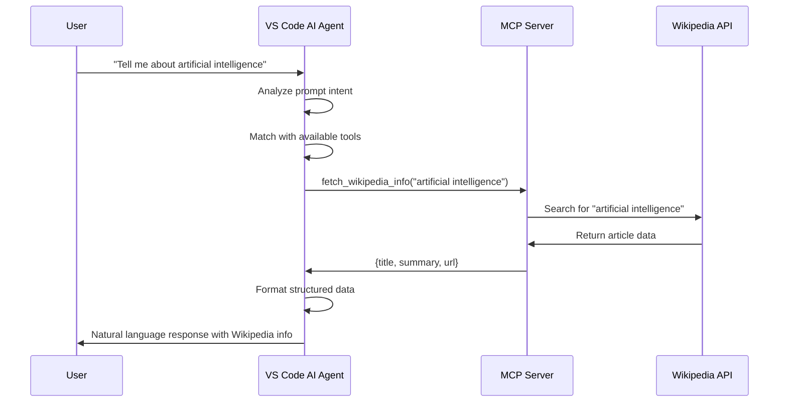

# How VS Code Agent Determines MCP Tool Selection

## 🎯 **Understanding MCP's Intelligent Tool Selection**

This document explains exactly how the VS Code AI agent intelligently decided to call your `fetch_wikipedia_info` tool when you asked "Tell me about artificial intelligence." This demonstrates the Model Context Protocol (MCP) working as designed.

## 📊 **The Complete Decision-Making Process**

### **Phase 1: 🔍 Tool Discovery**

When VS Code starts with your MCP server, it automatically performs tool discovery:

**What VS Code Requests:**
```
VS Code → MCP Server: "What tools do you have?"
```

**What Your Server Responds:**
```json
{
  "server_name": "WikipediaSearch",
  "tools": [
    {
      "name": "fetch_wikipedia_info",
      "description": "Search Wikipedia for a topic and return title, summary, and URL of the best match.",
      "parameters": {
        "query": {"type": "string", "required": true}
      },
      "returns": "dict"
    }
  ]
}
```

**Key Metadata Extracted:**
- **Server Name**: `WikipediaSearch` (indicates Wikipedia functionality)
- **Tool Name**: `fetch_wikipedia_info` (contains "wikipedia" keyword)
- **Description**: Clear explanation of Wikipedia search capability
- **Parameters**: Expects a `query: str` (search term)
- **Return Type**: `dict` (structured data)

### **Phase 2: 🧠 Prompt Analysis (LLM-Dependent)**

When you asked: **"Tell me about artificial intelligence"**

> **🔑 Key Insight**: This phase relies heavily on the underlying LLM and AI agent capabilities. The quality of prompt analysis directly depends on the sophistication of the language model powering VS Code's AI agent.

**Intent Recognition (LLM-Powered):**
```
Prompt: "Tell me about artificial intelligence"
├── Intent: "Tell me about" → Information seeking/research request
├── Subject: "artificial intelligence" → Specific topic to research  
└── Expectation: Implicit → User wants comprehensive information
```

**Semantic Analysis (Model-Dependent):**
- **Information Request**: User is asking for knowledge/facts
- **Topic-Based**: Request is about a specific subject
- **Comprehensive**: "Tell me about" implies detailed information needed
- **Encyclopedic Nature**: "Artificial intelligence" is a well-defined topic

**LLM Capabilities That Matter:**
- **Natural Language Understanding**: Parsing intent from conversational language
- **Context Awareness**: Understanding implicit expectations
- **Domain Knowledge**: Recognizing "artificial intelligence" as an encyclopedic topic
- **Semantic Reasoning**: Matching user needs with tool capabilities

### **Phase 3: 🎯 Tool Matching Logic**

The AI agent performs sophisticated matching between user intent and available tools:

**Matching Factors:**

| Factor | User Request | Tool Capability | Match Score |
|--------|-------------|-----------------|-------------|
| **Purpose** | Information seeking | Wikipedia search | ✅ Perfect |
| **Scope** | Specific topic | Topic-based queries | ✅ Perfect |
| **Source Quality** | Reliable information | Wikipedia (trusted source) | ✅ Perfect |
| **Data Format** | Comprehensive answer | Title + summary + URL | ✅ Perfect |
| **Parameter Type** | Topic string | `query: str` | ✅ Perfect |

**Semantic Matching Analysis:**
```
✅ Topic Research: User wants information about a specific topic
   → Matches Wikipedia search purpose perfectly

✅ Comprehensive Info: User expects detailed information  
   → Wikipedia provides comprehensive articles

✅ Reliable Source: Information request implies need for reliability
   → Wikipedia is a trusted information source

✅ Structured Response: AI needs structured data to format response
   → Tool returns title, summary, URL - ideal for AI processing

✅ Query Format: 'artificial intelligence' is a searchable term
   → Matches expected query parameter exactly
```

### **Phase 4: 🔄 MCP Communication Flow**

Here's the complete communication sequence:



**Step-by-Step Breakdown:**

1. **Tool Discovery** (Startup)
   ```
   VS Code → MCP Server: Request available tools
   MCP Server → VS Code: Tool metadata (name, description, parameters)
   ```

2. **Prompt Analysis** (User Input)
   ```
   VS Code AI Agent: Analyzes "Tell me about artificial intelligence"
   Result: Information seeking request about specific topic
   ```

3. **Tool Selection** (Decision Making)
   ```
   VS Code AI Agent: Matches prompt intent with tool capabilities
   Decision: fetch_wikipedia_info is perfect match
   ```

4. **Tool Execution** (MCP Call)
   ```
   VS Code → MCP Server: fetch_wikipedia_info("artificial intelligence")
   MCP Server → Wikipedia: HTTP request to Wikipedia API
   Wikipedia → MCP Server: Article data (title, summary, content)
   MCP Server → VS Code: {title, summary, url}
   ```

5. **Response Generation** (Final Output)
   ```
   VS Code AI Agent: Formats structured data into natural language
   User receives: Comprehensive answer about artificial intelligence
   ```

## 🎨 **Why This Tool Selection Was So Effective**

### **Perfect Metadata Alignment**

**From Your Server Code:**
```python
@mcp.tool()
def fetch_wikipedia_info(query: str) -> dict:
    """
    Search Wikipedia for a topic and return title, summary, and URL of the best match.
    """
```

**What Made It Perfect:**

| Element | Value | Why It Worked |
|---------|-------|---------------|
| **Function Name** | `fetch_wikipedia_info` | Contains "wikipedia" - immediately identifies purpose |
| **Description** | "Search Wikipedia for a topic..." | Crystal clear functionality explanation |
| **Parameter** | `query: str` | Exactly matches user input type |
| **Return Type** | `dict` | Structured data perfect for AI formatting |
| **Server Name** | `WikipediaSearch` | Reinforces Wikipedia focus |

### **Semantic Clarity**

**The AI agent understood:**
- **"Wikipedia"** = Reliable information source
- **"Search"** = Information retrieval capability  
- **"Topic"** = Matches user's subject-based request
- **"Title, summary, URL"** = Comprehensive response format

### **Parameter Compatibility**

**Perfect Match:**
```
User Input: "artificial intelligence" (string)
Tool Expects: query: str
Result: Direct compatibility, no conversion needed
```

### **Output Suitability**

**Tool Returns:**
```json
{
  "title": "Artificial intelligence",
  "summary": "Comprehensive overview...",
  "url": "https://en.wikipedia.org/wiki/Artificial_intelligence"
}
```

**AI Agent Can:**
- Use title for context
- Present summary as main content
- Provide URL for further reading
- Format everything naturally

## 🔍 **Key Decision Factors**

The VS Code agent chose `fetch_wikipedia_info` because of these critical factors:

### **1. High Relevance Score**
- Tool name contains "wikipedia" - directly matches information seeking
- Description explicitly mentions topic search capability

### **2. Clear Purpose Alignment**
- User wants: Information about a topic
- Tool provides: Wikipedia search for topics
- Perfect functional match

### **3. Parameter Compatibility**
- User provides: A topic string ("artificial intelligence")
- Tool expects: `query: str`
- Direct parameter mapping possible

### **4. Structured Output**
- AI needs: Structured data to format responses
- Tool returns: Dictionary with title, summary, URL
- Ideal format for natural language generation

### **5. No Ambiguity**
- Only one tool available, but perfectly suited
- Clear, unambiguous functionality
- No competing tools to choose from

### **6. Topic Suitability**
- "Artificial intelligence" is encyclopedic topic
- Wikipedia is ideal source for such topics
- High probability of comprehensive coverage

## 🚀 **MCP's Intelligence in Action**

This example demonstrates MCP's core strengths, **but with important dependencies**:

### **Automatic Discovery**
- No manual tool registration needed
- VS Code automatically found and understood your tool
- Metadata-driven tool discovery

### **Semantic Understanding (LLM-Dependent)**
- AI agent analyzed user intent semantically
- Matched intent with tool capabilities intelligently
- No keyword matching - true semantic analysis
- **⚠️ Quality depends on underlying LLM capabilities**

### **Type Safety**
- Parameter types ensured compatibility
- Return types enabled proper response formatting
- Type hints guided intelligent tool selection

### **Seamless Integration**
- No configuration needed for tool selection
- Automatic parameter mapping
- Natural language response generation

## 🧠 **The Role of the Underlying LLM**

**Critical Dependencies:**

### **1. Language Understanding Quality**
```
Better LLM → Better Intent Recognition → Better Tool Selection
Weaker LLM → Missed Nuances → Suboptimal Tool Choice
```

### **2. Semantic Reasoning Capabilities**
- **Advanced LLMs**: Can understand complex, implicit requests
- **Basic LLMs**: May require more explicit, keyword-heavy prompts
- **Domain Knowledge**: LLM's training affects topic recognition

### **3. Context Awareness**
- **Sophisticated Models**: Understand conversational context and implied needs
- **Simpler Models**: May focus only on explicit keywords
- **Multi-turn Reasoning**: Better models maintain context across interactions

### **4. Tool Selection Accuracy**
**Factors Affecting Selection Quality:**
- **Training Data**: LLM's exposure to similar tool/API scenarios
- **Reasoning Depth**: Ability to match abstract concepts with concrete tools
- **Confidence Calibration**: Knowing when to use tools vs. generate responses directly

## 📋 **Best Practices Demonstrated**

Your implementation showcases MCP best practices:

### **1. Descriptive Naming**
```python
# ✅ Good: Clear, descriptive name
def fetch_wikipedia_info(query: str) -> dict:

# ❌ Bad: Vague, unclear name  
def get_data(input: str) -> dict:
```

### **2. Clear Documentation**
```python
# ✅ Good: Explains exactly what tool does
"""
Search Wikipedia for a topic and return title, summary, and URL of the best match.
"""

# ❌ Bad: Vague or missing description
"""
Gets information.
"""
```

### **3. Proper Type Hints**
```python
# ✅ Good: Clear parameter and return types
def fetch_wikipedia_info(query: str) -> dict:

# ❌ Bad: No type information
def fetch_wikipedia_info(query) -> dict:
```

### **4. Structured Returns**
```python
# ✅ Good: Consistent, structured response
return {
    "title": page.title,
    "summary": page.summary,
    "url": page.url
}

# ❌ Bad: Inconsistent or unstructured
return page.summary  # Just a string
```

### **5. Comprehensive Error Handling**
```python
# ✅ Good: Handles different error scenarios
except wikipedia.DisambiguationError as e:
    return {"error": f"Ambiguous topic. Try one of these: {', '.join(e.options[:5])}"}

except wikipedia.PageError:
    return {"error": "No Wikipedia page could be loaded for this query."}
```

## 🎯 **Understanding the "Magic"**

**The "magic" of MCP tool selection is actually a combination of:**

1. **Rich Metadata**: Your tool provides comprehensive information about its capabilities
2. **Semantic Analysis**: AI agents analyze user intent and match it with tool purposes (**LLM-dependent**)
3. **Type Compatibility**: Parameter and return types guide intelligent selection
4. **Clear Documentation**: Descriptions help AI understand when to use tools
5. **Structured Communication**: MCP protocol enables seamless tool discovery and execution
6. **🧠 Underlying LLM Quality**: The sophistication of the language model directly impacts analysis quality

**This isn't random or luck - it's intelligent design working as intended, but the quality depends on the LLM powering the agent!**

## ⚖️ **LLM Quality Impact Examples**

### **High-Quality LLM (e.g., GPT-4, Claude):**
```
User: "Tell me about artificial intelligence"
Analysis: ✅ Recognizes information-seeking intent
         ✅ Identifies encyclopedic topic
         ✅ Matches with Wikipedia tool perfectly
         ✅ Understands structured response needs
Result: Perfect tool selection
```

### **Lower-Quality LLM:**
```
User: "Tell me about artificial intelligence"  
Analysis: ❓ May focus on keywords only
         ❓ Might miss implicit information need
         ❓ Could default to direct response instead of tool use
         ❓ Less sophisticated semantic matching
Result: Suboptimal or missed tool selection
```

### **Implications for Tool Design:**

**For Advanced LLMs:**
- Can use nuanced descriptions
- Implicit functionality is understood
- Complex semantic matching works well

**For Basic LLMs:**
- Need more explicit, keyword-rich descriptions
- Should include usage examples in docstrings
- Benefit from clearer parameter naming

## 🔄 **Testing Tool Selection Logic**

You can test and understand tool selection by running:

```bash
# See what metadata your server exposes
python demonstrate_mcp_metadata.py

# Test your MCP configuration
python test_mcp_config.py

# Try different prompts to see tool selection in action
```

**Try these prompts to see tool selection:**
- ✅ "Tell me about quantum computing" → Should trigger fetch_wikipedia_info
- ✅ "What is machine learning?" → Should trigger fetch_wikipedia_info  
- ✅ "Explain photosynthesis" → Should trigger fetch_wikipedia_info
- ❓ "What's the weather today?" → Might not trigger (not encyclopedic topic)

## 🎉 **Summary**

**Your Wikipedia Research Assistant succeeded because:**

1. **📝 Excellent Metadata**: Clear, descriptive tool information
2. **🎯 Perfect Scope**: Tool does exactly what its name/description suggests
3. **🔧 Proper Types**: Type hints enable intelligent parameter matching  
4. **📊 Structured Output**: Dictionary return format ideal for AI processing
5. **🌟 Semantic Clarity**: "Wikipedia" + "search" + "topic" = crystal clear purpose
6. **🧠 Advanced LLM**: VS Code likely uses a sophisticated language model capable of nuanced semantic analysis

**This demonstrates MCP working exactly as designed** - intelligent, automatic tool selection based on comprehensive metadata analysis and semantic understanding, **powered by capable LLM reasoning**!

## 🎛️ **Hyperparameter Impact on Tool Selection**

### **Why Hyperparameters Matter for MCP**

Even with modern, capable LLMs, hyperparameters like **temperature**, **top-k**, and **top-p** significantly impact MCP tool selection quality and consistency:

#### **🌡️ Temperature Impact**
- **Low (0.1-0.3)**: Highly consistent but potentially rigid tool selection
- **Medium (0.4-0.6)**: ✅ **Recommended** - Balanced consistency and flexibility  
- **High (0.7-1.0)**: Creative but inconsistent, may miss obvious tool choices

#### **🔝 Top-K and Top-P Impact**
- **Conservative settings**: Very consistent but may miss edge cases
- **Balanced settings**: ✅ **Recommended** - Good for most MCP applications
- **Exploratory settings**: Unpredictable, less suitable for production

### **Recommended Settings for MCP Systems**

**Production MCP Systems:**
- Temperature: `0.4`
- Top-K: `30`
- Top-P: `0.85`

**Development/Testing:**
- Temperature: `0.6` (more exploration)
- Top-K: `50` (broader consideration)  
- Top-P: `0.9` (more flexibility)

### **Why These Settings Matter**

1. **Consistency is Critical**: Users expect predictable tool behavior
2. **Error Cost**: Wrong tool selection is more costly than suboptimal text generation
3. **User Experience**: Inconsistent behavior reduces trust in the system
4. **Edge Cases**: Need balance between reliability and handling unusual prompts

### **Testing Strategy**

1. Create test suite with diverse prompt types (clear, ambiguous, edge cases)
2. Test different hyperparameter combinations
3. Measure tool selection accuracy and consistency
4. Monitor real-world performance and adjust accordingly

> **📊 Detailed Analysis**: Run `python llm_hyperparameters_impact.py` to see comprehensive examples of how hyperparameters affect tool selection in various scenarios.

## 🔑 **Key Insight: LLM Dependency**

**Remember:** The quality of MCP tool selection is fundamentally limited by the capabilities of the underlying language model AND its hyperparameter configuration. Your excellent tool design enables good selection, but the LLM's reasoning capabilities and settings determine how well that potential is realized.

**Design Implication:** When building MCP tools, consider:
1. The range of LLM capabilities that might interact with your tools
2. The hyperparameter settings that will be used
3. Design accordingly - from explicit keyword-rich descriptions for basic models to nuanced semantic descriptions for advanced ones
4. Test with different hyperparameter configurations to ensure robust performance

---

**📚 Related Files:**
- `demonstrate_mcp_metadata.py` - Shows metadata exposure
- `test_mcp_config.py` - Validates MCP configuration
- `MCP_INTEGRATION_GUIDE.md` - Setup instructions
- `QUICK_MCP_REFERENCE.md` - Configuration reference 